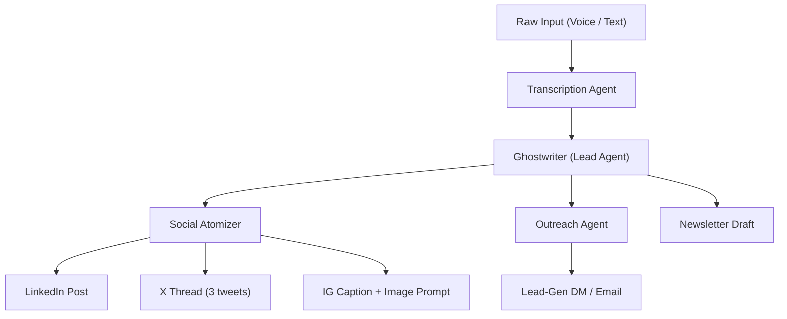

# Project ACE x OpenClaw — The Proactive Ghost
## Objective

Build a **Tech-Enabled Ghostwriting Agency** that uses OpenClaw to turn raw creator thoughts (voice/text) into an all-encompassing content ecosystem — a private content agency in a box.

---

## The Product: "The Proactive Ghost"

- **Core Logic:** Uses OpenClaw's **Heartbeat** feature to proactively engage the user (prodding them for thoughts, news, or opinions) rather than waiting for a prompt.
- **Input:** Multi-channel — Telegram, WhatsApp, iMessage, Slack, SMS, Email.
- **Processing:** A multi-agent waterfall. One input triggers a "Soul-aligned" ghostwriter to produce a Newsletter, LinkedIn posts, X threads, and lead-gen follow-ups.
- **Memory:** Persistent Markdown-based memory (`SOUL.md` for voice, `STRATEGY.md` for performance logs) to improve output quality over time.

---

## Current Technical Status

|Area|Detail|
|---|---|
|**Framework**|OpenClaw (Local/Node.js based agentic gateway)|
|**Models**|Router strategy — cheap models (Gemini Flash / GPT-4.5 / 5.0 / 5.3-mini) for heartbeats; premium models (Claude Opus, GPT 5.3/5.4, Gemini Pro) for final creative output|
|**Deployment**|Managed tenant instances — each client gets a private Dockerized OpenClaw instance funded by an upfront setup fee|

---

## Expanding the "Nervous System" (Channels)

OpenClaw is headless — it doesn't care which app you use.

|Channel|Best For|Notes|
|---|---|---|
|**Slack**|B2B / Corporate clients|Agent lives in a private channel; team (VA/manager) can see drafts|
|**iMessage**|High-end creators|Requires Mac cloud server (MacStadium) for imsg bridge — feels like a real contact|
|**SMS / MMS**|Non-Telegram clients|Via Twilio, ~$0.01–0.02/msg|
|**Email**|Passive input|Creator BCCs the agent on threads; agent replies with a draft|
|**Telegram**|Default / Power users|Native OpenClaw support|
|**WhatsApp**|International creators|Broad reach|

---

## The Content Multiplier (Waterfall Workflow)

One 60-second voice note triggers a sequence of specialist agents:

1. **Transcription Agent** — Cleans up "umms" and "ahhs."
2. **The Ghostwriter (Lead Agent)** — Drafts the main "Core" piece (e.g. a 1,500-word Newsletter).
3. **The Social Atomizer** — Breaks the newsletter into:
    - 1× LinkedIn "Authority" post
    - 3× X/Threads "Hook" posts
    - 1× IG Caption + Image Prompt (for Canva/Midjourney)
4. **The Outreach Agent** — Drafts a follow-up DM or email for lead-gen.

---

## Economics (Price to Value)

<aside> 💰

A high-end ghostwriter for a CEO costs $5,000–$10,000/month. By automating 90%, you price at a "No-Brainer" level.

</aside>

| Item                 | Price                 | Notes                                                                     |
| -------------------- | --------------------- | ------------------------------------------------------------------------- |
| **Setup Fee**        | $997 (one-time)       | OpenClaw tenant build, custom [SOUL.md](http://SOUL.md), Heartbeat tuning |
| **Subscription**     | $497/month            | Ongoing service                                                           |
| **Client API Costs** | ~$30/month            | Pass-through — client connects own OpenAI/Anthropic key                   |
| **Your Profit**      | $497/month per client | Near-zero overhead once built                                             |
# PAGE 2 
This document is the **Voice Identity Blueprint** for The Proactive Ghost. Every client gets a custom `SOUL.md` that teaches the AI to write exactly like them. This is the template and onboarding process for building one.

---

## Purpose [SOUL.md](http://soul.md/) — Voice Identity Blueprint

<aside> 🧬

`SOUL.md` is the creator's **digital DNA**. It captures their voice, worldview, vocabulary, and stylistic fingerprint so every piece of ghostwritten content sounds authentically _them_.

</aside>

---

## [SOUL.md](http://SOUL.md) Template

```markdown
# SOUL.md — Voice Identity File
# Client: {creator_name}
# Created: {date}
# Last Updated: {date}
# Version: 1.0

---

## 1. IDENTITY

name: "{creator_name}"
role: "{their title / how they describe themselves}"
niche: "{primary topic area}"
audience: "{who they're talking to}"
mission: "{one-sentence purpose statement}"

## 2. VOICE PROFILE

### Tone Spectrum (1 = never, 5 = always)
casual: {1-5}
authoritative: {1-5}
humorous: {1-5}
vulnerable: {1-5}
contrarian: {1-5}
inspirational: {1-5}
technical: {1-5}
storytelling: {1-5}

### Signature Patterns
- Opening style: "{how they typically start posts — question, bold claim, story, etc.}"
- Closing style: "{how they end — CTA, reflection, one-liner, etc.}"
- Sentence length: "{short and punchy / long and flowing / mixed}"
- Paragraph length: "{1-2 sentences / 3-4 sentences / varies}"
- Favorite transitions: ["{list their go-to connectors}"]
- Power words: ["{words they overuse intentionally}"]
- Words to NEVER use: ["{words that feel off-brand}"]

### Formatting Preferences
- Uses emojis: {yes/no/sparingly}
- Uses line breaks for emphasis: {yes/no}
- Uses ALL CAPS for emphasis: {yes/no}
- Preferred list style: {bullets / numbered / dashes}
- Hashtag strategy: "{their approach}"

## 3. WORLDVIEW

### Core Beliefs
1. "{belief #1 — the hill they'd die on}"
2. "{belief #2}"
3. "{belief #3}"

### Hot Takes
- "{contrarian opinion #1}"
- "{contrarian opinion #2}"
- "{contrarian opinion #3}"

### Topics They Love
- {topic 1}
- {topic 2}
- {topic 3}

### Topics They Avoid
- {topic 1}
- {topic 2}

## 4. WRITING SAMPLES

### Sample 1: {platform — e.g. LinkedIn}
> {Paste 200-500 words of their best-performing post}

Analysis: {tone, structure, hooks used}

### Sample 2: {platform}
> {Paste another sample}

Analysis: {tone, structure, hooks used}

### Sample 3: {platform}
> {Paste another sample}

Analysis: {tone, structure, hooks used}

## 5. ANTI-PATTERNS (What NOT to sound like)

- Never sound like: "{generic LinkedIn influencer / corporate jargon / etc.}"
- Avoid: "{specific phrases or styles that are off-brand}"
- The creator is NOT: "{misconceptions to guard against}"

## 6. PLATFORM ADAPTATIONS

### LinkedIn
- Tone adjustment: {slightly more professional}
- Max length: {1,300 chars recommended}
- Hook style: {bold claim or question}

### X (Twitter)
- Tone adjustment: {punchier, more casual}
- Max length: {280 chars per tweet, threads up to 10}
- Hook style: {hot take or stat}

### Newsletter
- Tone adjustment: {more personal, longer-form}
- Structure: {intro → story → lesson → CTA}
- Length: {800-1,500 words}

### Instagram
- Tone adjustment: {visual-first, caption secondary}
- Max length: {2,200 chars}
- Style: {personal story + lesson}
```

---

## Onboarding Process: Building a Client's [SOUL.md](http://SOUL.md)

### Step 1: Intake Call (30 min)

Run through the **Voice Discovery Interview**:

1. "How would your best friend describe the way you talk?"
2. "What 3 creators do you admire? What specifically about their style?"
3. "What's a post you've written that felt the most _you_?"
4. "What's a post you've seen that made you cringe? Why?"
5. "If your brand had a soundtrack, what genre would it be?"

### Step 2: Sample Collection

Collect **5–10 writing samples** across platforms. Prioritize:

- Their highest-engagement posts
- Posts they're most proud of (regardless of metrics)
- Any long-form writing (blogs, newsletters)

### Step 3: AI Analysis Pass

Feed the samples into the Lead Agent with this prompt:

```
Analyze these writing samples and extract:
1. Dominant tone (with confidence score)
2. Average sentence length
3. Vocabulary complexity (Flesch-Kincaid grade)
4. Recurring phrases and word patterns
5. Structural patterns (how they open, build, close)
6. Emotional register (analytical vs. emotional spectrum)

Output as a structured SOUL.md voice profile.
```

### Step 4: Calibration Loop

1. Generate 3 sample posts using the draft `SOUL.md`
2. Send to client for feedback: _"Does this sound like you? Rate 1–10."_
3. Iterate on the voice profile until score ≥ 8/10
4. Lock the `SOUL.md` as v1.0

### Step 5: Ongoing Refinement

- The system logs which outputs the client edits heavily vs. approves as-is
- Every 30 days, auto-generate a `SOUL.md` diff suggestion based on editing patterns
- Client approves or rejects refinements

---

## Implementation Checklist

- [ ] Finalize the [SOUL.md](http://SOUL.md) YAML/Markdown schema
- [ ] Build the Voice Discovery Interview script (for sales/onboarding calls)
- [ ] Create the AI analysis prompt chain for sample ingestion
- [ ] Build the calibration feedback loop (Telegram/Slack bot flow)
- [ ] Set up the 30-day auto-refinement cron job
- [ ] Store [SOUL.md](http://SOUL.md) in `/tenants/{client_id}/SOUL.md` with version history

# PAGE 3 Content Waterfall Skill — Technical Definition

This document defines the **Content Waterfall Skill** — the core OpenClaw tool that takes a single raw transcript and routes it through a multi-agent pipeline to produce 4–5 distinct content outputs.

---

## Architecture Overview



---

## Skill Definition (TypeScript)

This is the primary OpenClaw skill that orchestrates the waterfall.

```tsx
// skills/content-waterfall.ts
// OpenClaw Skill: Content Waterfall
// Trigger: New transcript received from any channel

import { Skill, Agent, Context, Output } from '@openclaw/sdk';
import { readFile } from 'fs/promises';

// ── Types ───────────────────────────────────────────────

interface WaterfallInput {
  transcript: string;        // Raw transcript text
  channel: string;           // Source channel (telegram, slack, imessage, etc.)
  clientId: string;          // Tenant ID
  metadata?: {
    duration?: number;       // Voice note duration in seconds
    timestamp?: string;      // ISO timestamp
    context?: string;        // Any contextual info from the heartbeat prompt
  };
}

interface WaterfallOutput {
  newsletter: string;
  linkedin: string;
  xThread: string[];
  igCaption: string;
  imagePrompt: string;
  outreachDraft: string;
  metadata: {
    processedAt: string;
    modelUsage: Record<string, number>;
    qualityScore: number;
  };
}

// ── Skill Registration ──────────────────────────────────

export const contentWaterfall: Skill<WaterfallInput, WaterfallOutput> = {
  name: 'content-waterfall',
  description: 'Transforms a single transcript into multi-platform content',
  version: '1.0.0',

  async execute(input: WaterfallInput, ctx: Context): Promise<WaterfallOutput> {

    // 1. Load client voice identity
    const soul = await readFile(
      `./tenants/${input.clientId}/SOUL.md`, 'utf-8'
    );
    const strategy = await readFile(
      `./tenants/${input.clientId}/STRATEGY.md`, 'utf-8'
    );

    // 2. STAGE 1 — Clean Transcript
    const cleanTranscript = await ctx.runAgent('transcription-cleaner', {
      model: 'gemini-flash',          // Cheap model for simple task
      prompt: `Clean this transcript. Remove filler words (um, uh, like, you know).
               Fix grammar but preserve the speaker's natural phrasing.
               Do NOT change meaning or add content.
               \\n\\nRAW TRANSCRIPT:\\n${input.transcript}`,
    });

    // 3. STAGE 2 — Ghostwriter (Lead Agent) → Newsletter
    const newsletter = await ctx.runAgent('ghostwriter', {
      model: 'claude-opus',            // Premium model for core creative
      systemPrompt: `You are a ghostwriter. Write EXACTLY in this voice:\\n${soul}`,
      prompt: `Write a 1,200–1,500 word newsletter based on this transcript.
               Structure: Hook → Story/Insight → Lesson → CTA.
               Performance context from STRATEGY.md:\\n${strategy}
               \\n\\nCLEAN TRANSCRIPT:\\n${cleanTranscript.output}`,
    });

    // 4. STAGE 3 — Social Atomizer → LinkedIn + X + IG
    const socialBundle = await ctx.runAgent('social-atomizer', {
      model: 'gpt-5.3-mini',          // Mid-tier for adaptation
      systemPrompt: `You adapt long-form content into social posts.
                     Voice guide:\\n${soul}`,
      prompt: `From this newsletter, create:
               1. ONE LinkedIn post (max 1,300 chars). Authority tone. Bold opening hook.
               2. THREE X/Twitter posts (max 280 chars each). Punchy. Standalone value.
               3. ONE Instagram caption (max 2,200 chars) + a Midjourney image prompt.

               Return as JSON with keys: linkedin, xThread[], igCaption, imagePrompt.
               \\n\\nNEWSLETTER:\\n${newsletter.output}`,
    });

    // 5. STAGE 4 — Outreach Agent → Lead-Gen Draft
    const outreach = await ctx.runAgent('outreach-drafter', {
      model: 'gpt-5.0-mini',          // Cheap model for templated output
      systemPrompt: `You write brief outreach messages for lead generation.
                     Voice guide:\\n${soul}`,
      prompt: `Based on this newsletter topic, draft a short DM or email (max 150 words)
               the creator can send to a potential lead or collaborator.
               Make it feel personal, not salesy.
               \\n\\nNEWSLETTER TOPIC:\\n${newsletter.output.substring(0, 500)}`,
    });

    // 6. Parse and return
    const social = JSON.parse(socialBundle.output);

    return {
      newsletter: newsletter.output,
      linkedin: social.linkedin,
      xThread: social.xThread,
      igCaption: social.igCaption,
      imagePrompt: social.imagePrompt,
      outreachDraft: outreach.output,
      metadata: {
        processedAt: new Date().toISOString(),
        modelUsage: ctx.getModelUsage(),
        qualityScore: await ctx.evaluateQuality(newsletter.output, soul),
      },
    };
  },
};
```

---

## Agent Definitions

|Agent|Model|Cost Tier|Purpose|
|---|---|---|---|
|`transcription-cleaner`|Gemini Flash|💚 Cheap|Remove filler words, fix grammar|
|`ghostwriter`|Claude Opus|🔴 Premium|Core newsletter draft (voice-aligned)|
|`social-atomizer`|GPT-5.3-mini|🟡 Mid|Break newsletter into social posts|
|`outreach-drafter`|GPT-5.0-mini|💚 Cheap|Generate lead-gen DM/email|

---

## Estimated Cost Per Run

|Stage|Input Tokens (est.)|Output Tokens (est.)|Cost (est.)|
|---|---|---|---|
|Transcription Cleaner|~500|~400|$0.001|
|Ghostwriter|~2,000|~2,000|$0.12|
|Social Atomizer|~2,500|~800|$0.02|
|Outreach Drafter|~800|~200|$0.005|
|**Total per run**|||**~$0.15**|

At ~5 runs/week = **~$3/month** in API costs per client. Well under the $30 estimate.

---

## Output Delivery

After the waterfall completes, outputs are delivered back to the creator's channel:

1. **Immediate:** Summary message with the newsletter headline + social post previews
2. **Drafts folder:** All outputs saved to `/tenants/{client_id}/drafts/{date}/`
3. **Approval flow:** Creator replies with ✅ (approve), ✏️ (edit), or ❌ (reject) per piece
4. **Auto-publish (optional):** Approved content pushed to scheduling tools (Buffer, Typefully, Beehiiv API)

---

## Implementation Checklist

- [ ] Scaffold the `content-waterfall` skill in OpenClaw
- [ ] Build and test the `transcription-cleaner` agent
- [ ] Build and test the `ghostwriter` agent with [SOUL.md](http://SOUL.md) injection
- [ ] Build and test the `social-atomizer` agent with JSON output parsing
- [ ] Build and test the `outreach-drafter` agent
- [ ] Wire up the approval flow (channel-agnostic response handler)
- [ ] Add cost tracking per run (log to [STRATEGY.md](http://STRATEGY.md))
- [ ] Integration test: end-to-end from voice note → all 5 outputs